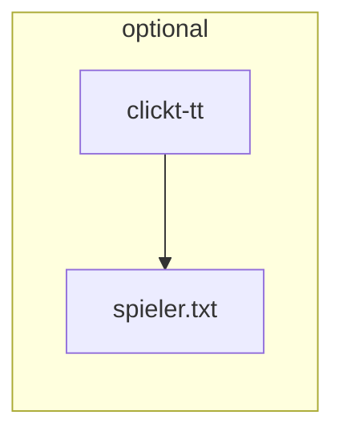
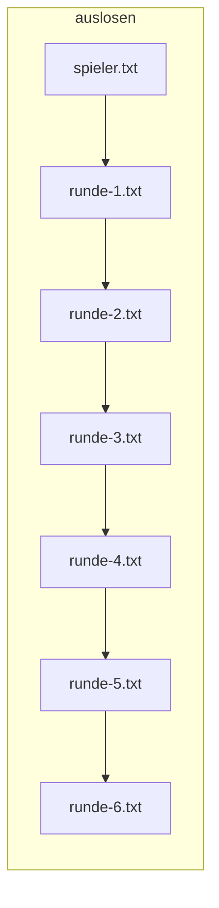

# Moved to https://codeberg.org/tgfuellner/ttSchweizer-python

# ttSchweizer
Tischtennis Turnier Software im Schweizer System

## Informationen zum Spielsystem

Das "Schweizer System" ähnelt dem System "jeder gegen jeden", wobei einerseits nicht alle Runden ausgetragen werden und andererseits im Turnierverlauf vor allem Spielerinnen/Spieler ähnlicher Spielstärke gegeneinander spielen.
Durch die feste Rundenanzahl ist der Zeitrahmen eines Turniers sehr gut planbar.
... siehe https://www.bttv.de/sport/bavarian-tt-race/infos-spielsystem/

## User Interface von **ttSchweizer**

* Konsolenbasiert
* Robust, stabil
* Eingaben werden mit einfachem Texteditor gemacht
* **ttSchweizer** wird in Verzeichnis mit verschiedenen Textfiles aufgerufen
* **ttSchweizer** kann zu jedem Zeitpunkt ausgeführt werden
* Für jede Runde gibt es ein Textfile: *runde-1.txt*, *runde-2.txt, ...
* Ist *runde-N.txt* vollständig erfasst, wird *runde-N+1.txt* erzeugt
* *spieler.txt* enthält Spieler mit ihren TTR Werten
* Fehlt *spieler.txt* und befindet sich im Verzeichnis ein Spieler Export aus click-tt, wird daraus *spieler.txt* erzeugt.
* *runde-1.txt* wird durch Losen aus *spieler.txt* erzeugt
* *ergebnis.html* wird nach jedem Aufruf aktualisiert

## Packet Abhängigkeitet

* sudo pip3 install flask
* sudo pip3 install flask-login
* sudo pip3 install Flask-SQLAlchemy
* sudo aptitude install python3-lxml libxml2-utils

Für Begleitzettel
* sudo aptitude install libffi-dev
* sudo aptitude install libxml2-dev libxslt-dev libpango1.0-0 libcairo2
* sudo pip3 install WeasyPrint
* sudo pip3 install Flask-WeasyPrint

## Docker oder Podman

* docker build -t tt-schweizer:latest .
* Mac needs --network bridge 
* docker run -l -d --network bridge -p 6000:5000 tt-schweizer
* To persist: docker run -l -d -v Data:/app/Data -u root -p 5000:5000 tt-schweizer
* Mac:
* sudo podman run --name=tt -l -d -v /Users/thomas/Git/ttSchweizer/Data:/app/Data -u root --network bridge -p 6000:5000 tt-schweizer
* podman stop tt; podman rm tt

## Cloud

* podman login -u tomgfuellner -p '....'  docker.io/tomgfuellner/tt-schweizer
* podman build -t tt-schweizer:1.0 .
* podman images
* podman push c4d875bdf4a0 docker://docker.io/tomgfuellner/tt-schweizer:1.0

## Google Cloud Run

* gcloud auth login
* gcloud config set project psychic-iridium-353811
* gcloud auth configure-docker
* docker tag 0d1879570d7d eu.gcr.io/psychic-iridium-353811/tt-schweizer:1.1
* docker push eu.gcr.io/psychic-iridium-353811/tt-schweizer:1.1

### Google Compute Engine

* gcloud compute ssh --zone "us-west1-b" tt --project "psychic-iridium-353811"

## Hints

* spieler.txt nach TTR sortieren: `sort -nr --field-separator=, --key=2 spieler.txt`
